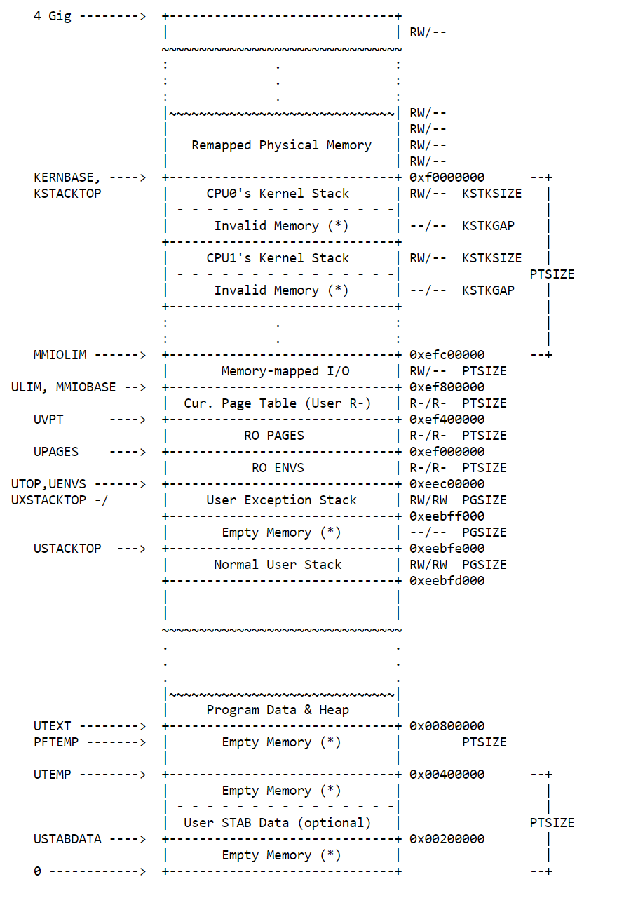
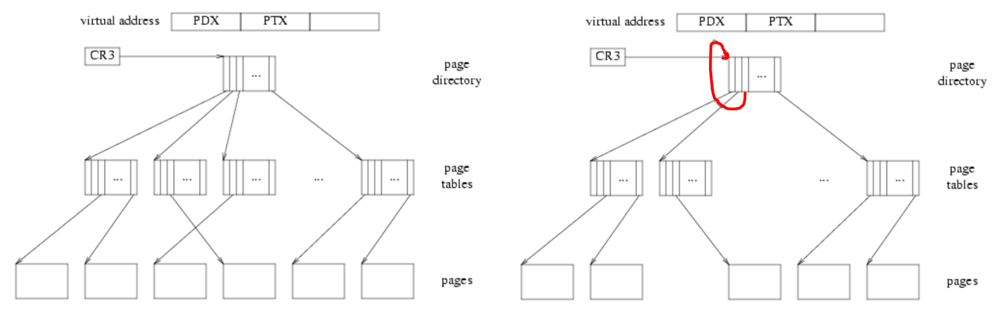

# Lecture 7: Using Virtual Memory (2)

PDF slides for the lecture is [HERE](../resources/virtual-memory-2.pdf).

## 1. Cool things we can do with vm

* Better performance/efficiency
  + e.g., one zero-filled page
  + e.g., copy-on-write fork
* New features
  + e.g., memory-mapped files
* JOS and VM
* This lecture may generate ideas for last lab (final project)

#### Several views on the virtual memory

* **primary purpose**: isolation - each process has its own address space
* virtual memory provides a level-of-indirection, providing kernel with opportunity to do cool stuff

#### Lazy/on-demand page allocation

* `sbrk()` is old fashioned
  + it asks application to "predict" how much memory they need
  + difficult for applications to predict how much memory they need in advance
  + `sbrk()` allocates memory that may never be used.
* modern OSes allocate memory lazily
  + allocate physical memory when application needs it
* HW solution
<!---
  draw xv6 user-part of address space
  demo solution; breakpoint right before mappages in trap.c
    explain page faults
-->

#### xv6 memory layout discussion

- user virtual addresses start at zero
  * of course user *VA* `0` maps to different *PA* for each process
- 2GB for user heap to grow contiguously
  * but needn't have contiguous phys mem - no fragmentation problem
- both kernel and user mapped
  * easy to switch for syscall, interrupt
- kernel mapped at same place for all processes
  * eases switching between processes
- easy for kernel to r/w user memory
  * using user addresses, e.g. sys call arguments
- easy for kernel to r/w physical memory
  * *PA* `x` mapped at *VA* `x+0x80000000`

#### Guard page to protect against stack overflow

* put a non-mapped page below user stack
  + if stack overflows, application will see page fault
* allocate more stack when application runs off stack into guard page
<!---
  draw xv6 user-part of address space
    compile with -O so the compiler doesn't optimize the tail recursion
  demo stackoverflow
      set breakpoint at g
      run stackoverflow
    look at $esp
    look at pg info at qemu console
    note page has no U bit
-->

#### One zero-filled page

* kernel often fills a page with zeros
* **idea**: **memset** *one* page with zeros
  + map that page copy-on-write when kernel needs zero-filled page
  + on write make copy of page and map it read/write in app address space

#### share kernel page tables in xv6

* **observation**:
  + `kvmalloc()` allocates new pages for kernel page table for each process
  + but all processes have the same kernel page table
* **idea**: modify `kvmalloc()`/`freevm()` to share kernel page table

#### Copy-on-write fork

* **observation**:
  + xv6 fork copies all pages from parent (see `fork()`)
  + but `fork` is often immediately followed by `exec`
* **idea**: share address space between parent and child
  + modify `fork()` to map pages copy-on-write (use extra available system bits in PTEs and PDEs)
  + on page fault, make copy of page and map it read/write

#### Demand paging

* **observation**: `exec` loads the complete file into memory (see `exec.c`)
  + expensive: takes time to do so (e.g., file is stored on a slow disk)
  + unnecessary: maybe not the whole file will be used
* **idea**: load pages from the file on demand
  + allocate page table entries, but mark them on-demand
  + on fault, read the page in from the file and update page table entry
* **challenge**: file larger than physical memory (see next idea)

#### Use virtual memory larger than physical memory

* **observation**: application may need more memory than there is physical memory
* **idea**: store less-frequently used parts of the address space on disk
  + page-in and page-out pages of the address address space transparently
* works when working sets fits in physical memory

#### Memory-mapped files

* **idea**: allow access to files using load and store
  + can easily read and writes part of a file
  + e.g., don't have to change offset using `lseek` system call
* page-in pages of a file on demand
  + when memory is full, page-out pages of a file that are not frequently used

#### Shared virtual memory

* **idea**: allow processes on different machines to share virtual memory
  + gives the illusion of physical shared memory, across a network
* replicate pages that are only read
* invalidate copies on write

## 2. JOS and virtual memory



#### UVPD/UVPT



Imagine a 2^20-entry array *PT* that we could index with a physical page number. The x86 2-level paging scheme breaks that giant *PT* into many smaller *PTs* and one *PD*. How does JOS figure out where the page is?

`CR3` points at the address to the *PD*. The *PDX* part of the virtual address indexes into the *PD* to give you a *PT*. The *PTX* part indexes into the *PT* to give a page. *PD* is a table to map the conceptual giant 2^22-byte page table (each maps 1024 pages) at some contiguous 2^22-byte range in the virtual address space. We can ensure user processes cannot modify their page tables by marking the *PDE* entry as read-only.

But the processor doesn't know the concept of *PD*/*PT*/page other than plain memory. The processor just follows pointers: `pd= = lcr3(); pt = *(pd+4*PDX); page = *(pt+4*PTX);`. In the diagram, it starts with `CR3`, follows three arrows, and then stop.

**How to map the pages being used as the *PD* and *PTs* (which are normally virtually invisible) into the virtual address space?**

If we put a pointer into the page directory that points back to itself at index *V*, when translating the virtual address with *PDX* and *PTX* equal to *V*, following three arrows will lead us back to the *PT*. In the JOS, *V* is `0x03BD`. The virtual address of `UVPD = (0x3BD<<22) | (0x3BD<<12)`.

If the virtual address with *PDX=V* but *PTX!=V*, following arrows from `CR3` ends one level up from the pages, i.e. *PT*. So the virtual address of `UVPT = 0x3BD << 22`.

#### UVPT trick (lab 4)

* recursively map *PD* at `0x3BD`
  - virtual address of *PD* is `(0x3BD<<22) | (0x3BD<<12)`
* if we want to find *pte* for virtual page *n*, compute

```
pde_t uvpt[n], where uvpt is (0x3BD << 22)
  = uvpt + n * 4 (because pdt is a word)
  = (0x3BD << 22) | (top 10 bits of n) | (bottom 10 bits of n) << 2
  = 10 | 10 | 12
```

* for example, `uvpt[0]` is address `(0x3BD << 22)`, following the pointers gives us the first entry in the page directory, which points to the first page table, which we index with 0, which gives us *pte* 0
* simpler than `pgdirwalk()`?

#### User-level copy-on-write fork (lab4)
  + JOS propagates page faults to user space
  + user programs can play similar VM tricks as kernel!
  + you will do user-level copy-on-write fork
